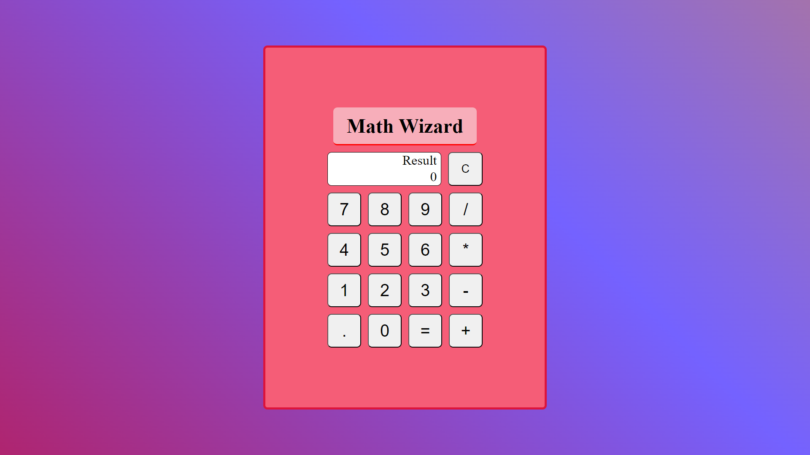

# Math Wizard

## A fully functional project showcasing a calculator with arithmetic operations and decimal calculations.

This project demonstrates the creation of Math Wizard, a fully functional calculator implemented with HTML, CSS, and JavaScript. It offers arithmetic operations, such as addition, subtraction, multiplication, and division, along with support for decimal calculations.

## How to install this example Golang project on Kubernetes

1. clone this project: git clone https://github.com/iamchrismolina/Calculator.git
2. navigate into the folder: cd Calculator
3. Run Live Server extension or just open index.html

## How to Use Math Wizard

Using Math Wizard is simple:

1. Enter your mathematical expression in the input field.
2. Click the relevant operator button or use the keypad to select your operation.
3. Math Wizard will provide you with the result, making it perfect for both simple and complex calculations.

## Try Math Wizard

Experience the convenience of Math Wizard and simplify your math-related tasks. You can try Math Wizard by visiting the live demo link above.

## Found a Bug or Have Feedback?

If you found an issue or would like to submit an improvement to this project, please submit an issue using the issues tab above. If you would like to submit a PR with a fix, reference the issue you created!

## Get Calculating

Math Wizard is your trusted companion for accurate arithmetic calculations. Try it now and make your math tasks a breeze.
